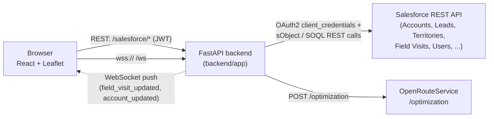
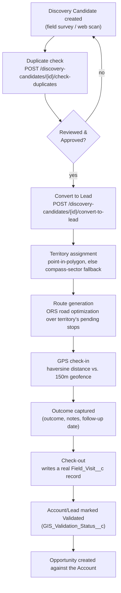

# JSAN GeoSales 360 — Architecture

A field-sales GIS app: a FastAPI backend that proxies/orchestrates a Salesforce org (the system of record) plus two external services (OpenRouteService for road routing, and a raw WebSocket for live push), and a React/Vite frontend built around a Leaflet map. There is no local database — Salesforce is the only persistent store.

## 1. System overview

- **Frontend**: React (Vite), talks to the backend over REST (`/salesforce/*`) and a single WebSocket (`/ws`).
- **Backend**: FastAPI (`backend/app`). Issues its own JWTs for app login; every other call re-authenticates itself to Salesforce using a separate OAuth2 client-credentials token.
- **Salesforce**: the system of record for Accounts, Leads, Opportunities, Discovery Candidates, Territories, Routes, Field Visits, Validation Evidence, and Users (custom objects/fields, e.g. `Territory_ID__c`, `Boundary_GeoJSON__c`, `GeoSales_Role__c`).
- **OpenRouteService (ORS)**: external HTTP API used only for route optimization (`routing_service.py`), called from the backend, not the browser.
- **WebSocket**: server-to-browser only, used to push a small set of "something changed in Salesforce" events so open map views refresh without polling.

## 2. Backend structure

`backend/app/` layout:

- **`main.py`** — creates the `FastAPI` app, configures CORS (allows `localhost:5173`/`127.0.0.1:5173` plus `FRONTEND_URL` from env), mounts `auth_router` (unauthenticated) and `salesforce_router` (mounted with `dependencies=[Depends(get_current_user)]`, i.e. every route in it requires a valid JWT), a catch-all exception handler that logs and returns a generic 500 JSON body, and the `/ws` WebSocket endpoint (accepts a connection, registers it via `connect_client`, then just reads-and-discards any client messages until disconnect — it's push-only from the server's side).
- **`auth.py`** — the app's own login layer, independent of Salesforce auth. `APP_USERS` (a JSON env var) holds `{username, password_hash, role}` entries; passwords are PBKDF2-HMAC-SHA256 hashed (`hash_password`/`verify_password`, 200k iterations, random salt). `create_access_token` issues an HS256 JWT (`JWT_SECRET_KEY`, default 480 min expiry) with `sub` (username) and `role` claims. `get_current_user` decodes/validates the bearer token — this is the dependency wired into every `/salesforce/*` route. `require_role(*roles)` is a second, optional dependency layered on top of `get_current_user` for routes that need real authorization, not just authentication.
- **`routers/salesforce_router.py`** — one router, prefix `/salesforce`, roughly 90 endpoints across Accounts, Leads, Opportunities, Discovery Candidates, Territories, Routes, Field Visits, Validation Evidence, Dashboard aggregates, GIS map-data endpoints, Users, and Routing. Each endpoint is a thin wrapper: parse/validate the request via a Pydantic schema, call one function in `services/salesforce_service.py`, return its result.
- **`services/salesforce_service.py`** — the actual business logic and Salesforce integration: builds SOQL queries / sObject REST calls via `sf_request()` (defined in `salesforce_client.py`), applies side effects like auto-assigning a random-but-territory-consistent location and territory to new Leads (`_assign_random_location` / `_assign_territory_by_point`), and implements the bulk operations `assign_territories_by_boundary()` and `realign_coordinates_to_territories()`.
- **`services/territory_assignment_service.py`** — pure geometry/logic, no I/O: point-in-polygon (ray casting) against a territory's saved `Boundary_GeoJSON__c`, with a compass-direction-sector fallback (territory codes like `HYD-NORTH` imply a 90°-wide quadrant radiating from the fixed Hyderabad-metro bounding box center) for any territory that has no hand-drawn boundary yet.
- **`services/routing_service.py`** — calls ORS's VROOM-based `/optimization` endpoint (one vehicle, one job per stop) to get a real road-optimized visiting order, route geometry, distance, and duration; raises `HTTPException` (503/400/502) if ORS isn't configured, there are no stops, or ORS itself fails.
- **`salesforce_client.py`** — Salesforce OAuth2 (client-credentials grant against `SF_LOGIN_URL`/`SF_CLIENT_ID`/`SF_CLIENT_SECRET`) fetched once at import time; `sf_request()` wraps `requests.request()`, retries once after calling `refresh_access_token()` on a 401, and turns any Salesforce HTTP error into a FastAPI `HTTPException` with the original status/body.
- **`realtime.py`** — the in-memory WebSocket registry (`connected_clients`, a plain `set`) and `broadcast_event(event_type, data)`, which fans a `{"type": ..., "data": ...}` JSON message out to every connected client, silently dropping any that error out (dead connections get discarded).
- **`schemas/`** — Pydantic request/response models per object (`account_schema.py`, `lead_schema.py`, `territory_schema.py`, `routing_schema.py`, etc.), used both for FastAPI validation and for `model_dump()` calls when building Salesforce payloads.

**Request flow** (typical): `Browser → salesforce_router endpoint → salesforce_service function → salesforce_client.sf_request() → Salesforce REST API`, response passed back up largely as-is. Two endpoints (visit update, account update) additionally call `broadcast_event()` after a successful Salesforce write, pushing a WebSocket message to every open browser tab.

**Auth/authorization model — stated precisely:**
- Every `/salesforce/*` endpoint requires a valid JWT (enforced once, centrally, via `main.py`'s `dependencies=[Depends(get_current_user)]` on the whole router) — this is *authentication*, not authorization.
- Exactly two endpoints layer real role-based *authorization* on top: `GET /salesforce/users` and `PUT /salesforce/users/{user_id}/role`, both gated by `require_role("ADMIN")`.
- Every other endpoint — all ~88 of the rest, covering every CRUD operation on every business object — only requires *a* valid, logged-in user of *any* role. A SALES_MANAGER or FIELD_USER JWT can call any Accounts/Leads/Territories/Routes/etc. endpoint a request is technically well-formed for. This is a documented, intentional scope boundary for this build, not an oversight — see §6.

## 3. Frontend structure

`App.jsx` renders `AuthProvider` → (once authenticated) `UserProvider` → a flex layout of `Sidebar` + `ModuleRenderer`, with `activeModule` as local state in `App.jsx` driving which module is shown (no router — it's a single-page tab switch).

- **`Sidebar.jsx`** filters its fixed `MODULES` list (dashboard, accounts, leads, opportunities, discovery, territories, routes, fieldVisits, evidence, gis, userRoles) down to whichever ones `hasPermission(module.permission)` allows for the current role, and renders a button for each.
- **`ModuleRenderer.jsx`** maps `activeModule` to a permission key and a component (`MODULE_COMPONENTS`), wraps the resolved component in `<ProtectedModule permission=...>` (a second, redundant gate against deep-linking/state directly to a module the sidebar wouldn't show), and renders it.

**Permission model** (`config/rolePermissions.js`, `config/permissions.js`, `context/UserContext.jsx`):
- Three roles: `ADMIN` (wildcard `"ALL"` — every permission, every module), `SALES_MANAGER`, `FIELD_USER`. Each non-admin role maps to an explicit array of fine-grained `PERMISSIONS` keys (e.g. `VIEW_ACCOUNTS`, `EDIT_ACCOUNTS`, `MANAGE_TERRITORIES`, `VIEW_ASSIGNED_ACCOUNTS`, `UPDATE_WORK_ORDER`, `UPLOAD_EVIDENCE`, ...).
- `MODULE_ACCESS` maps each sidebar module to the list of permission keys that unlock it; a role sees a module if it holds *any* one of that module's listed permissions (`hasModuleAccess`/`hasPermission` in `config/permissions.js`).
- `UserContext` exposes two functions to components: **`hasPermission(moduleKey)`** — actually module-*visibility* (despite the name) — is what `Sidebar` and `ModuleRenderer`/`ProtectedModule` use to decide whether a module is reachable at all; **`can(permissionKey)`** is the fine-grained, action-level check used *inside* a module a role can already see (e.g. `mapview.jsx` calls `can("MANAGE_TERRITORIES")`, `can("CREATE_WORK_ORDER")`, `can("UPDATE_WORK_ORDER")` to show/hide the boundary editor, route planner, and check-in/out controls respectively).

**GIS Map module** (`components/mapview.jsx` + `components/mapview/`) — recently split out of one 2,400-line file; each piece now owns one concern:

| File | Responsibility |
|---|---|
| `mapview.jsx` | The shell component: composes all the hooks below, owns filter/UI state (type/territory/priority/search, `showTerritories`), and renders the filters panel, Leaflet map, GIS control bar, and record detail panel. |
| `useRecordsData.js` | Fetches Accounts/Leads/Opportunities (map pins) and Territories from the backend on mount; also loads the full real Opportunity set (for the revenue trend chart, not the map). |
| `useTerritoryBoundary.js` | Draw/save a territory's boundary polygon, plus the two bulk re-derivation actions ("Recalculate Territory Assignments" and "Realign Coordinates to Territories"). |
| `useFieldVisit.js` | The on-site check-in → GPS geofence verification → outcome capture → check-out flow for a selected Account/Lead, plus which record is currently selected. |
| `useRouteGeneration.js` | Turns a territory's pending stops into a real road-optimized route via the backend's `/routing/optimize` (ORS), decoding the returned polyline for display. |
| `useLiveFeed.js` | Owns the `/ws` WebSocket connection; turns incoming push events into the live alert/activity feed entries shown in the dashboard panel. |
| `reportExport.js` | Client-side CSV/PDF export helpers (business data export, AI activity export, executive report) — no backend calls. |
| `mapviewUtils.js` | Pure helpers/constants shared across the module: priority/type colors, geofence radius constant, boundary GeoJSON parsing, `getCurrentPosition()` (browser geolocation), haversine distance, polyline decoding, AI-score/risk calculations. |
| `MapLayers.jsx` | Small Leaflet child components: `FitToRoute`/`FitToRecords` (auto-fit map bounds) and `TerritoryDrawControl` (wraps `leaflet-draw` for the boundary editor). |
| `executiveAnalytics.js` | Pure computation of the "AI Executive Dashboard" derived metrics (priority/territory charts, forecasts, AI opportunity/recommendation lists) from Accounts + real Opportunities; explicitly does **not** fold in Leads (a pre-existing scope limit). |
| `ExecutiveAnalyticsPanel.jsx` | Presentation-only: renders the charts/cards for whatever `executiveAnalytics.js` computed, via Recharts. |

## 4. Core business workflow

1. A **Discovery Candidate** is created (field survey, web scan, etc.) with a name/business/phone/address and coordinates.
2. Before conversion, `check_discovery_candidate_duplicates()` compares it against existing records (`services/duplicate_detection.py`) and classifies the match status.
3. Once a candidate's `Review_Status__c` is `Approved` (and it hasn't already been converted — `Related_Lead__c` is checked to block double-conversion), `convert_discovery_candidate_to_lead()` creates a real Salesforce **Lead**.
4. The new Lead gets a location and a **territory** assignment: `find_territory_code_for_point()` tests it against every territory's real saved boundary first, falling back to the compass-direction sector implied by the territory's own name (e.g. `HYD-NORTH`) for territories with no boundary drawn yet.
5. From the GIS Map, a manager/rep picks a territory and generates a **route**: pending Accounts/Leads in that territory are sent to `POST /routing/optimize`, which calls OpenRouteService's VROOM optimizer for a real road-based visiting order, distance, and ETA.
6. On site, the rep **checks in**: the browser's GPS position is compared (haversine) against the record's saved coordinates; check-in only proceeds if within the 150m geofence (`GEOFENCE_RADIUS_METERS`).
7. The rep captures the **outcome** (from a fixed `VISIT_OUTCOMES` list), free-text notes, and an optional follow-up date.
8. **Check-out** writes a real `Field_Visit__c` record (check-in/out timestamps, outcome, notes, follow-up date) and updates the Account/Lead's `Last_Visit_Date__c` and `GIS_Validation_Status__c` → `Validated`.
9. A validated Account can then have an **Opportunity** created/tracked against it through the normal Opportunities module.

## 5. Real-time layer

- **Transport**: a single raw WebSocket at `/ws` (`backend/app/main.py`), server push only — the handler reads incoming client frames but only logs them; it never itself replies to a client message.
- **Registry**: `realtime.py`'s `connected_clients` (a bare `set` of `WebSocket` objects, `connect_client`/`disconnect_client` add/remove on connect/disconnect).
- **What triggers a push**: exactly two call sites currently call `broadcast_event()`, both in `salesforce_router.py`, both *after* a successful Salesforce write:
  - `PUT /salesforce/visits/{visit_id}` → broadcasts `field_visit_updated` with the updated visit payload.
  - `PUT /salesforce/accounts/{account_id}` → broadcasts `account_updated` with the updated account payload.
  - Both are wrapped in `try/except` so a broadcast failure is logged but never fails the underlying write.
- **Frontend consumer**: `frontend/src/components/mapview/useLiveFeed.js` opens the socket on mount, and on each message:
  - `field_visit_updated` or `account_updated` → reloads Accounts and Leads (`loadAccounts()`/`loadLeads()`) so the map/dashboard reflect the change, and appends an entry to the live alert + live activity feed shown in the Executive Analytics panel.
  - `gis_updated` and `alert` message types are also handled on the frontend (same reload/feed pattern) but **no backend code currently sends either one** — the client is ready for events the server doesn't yet emit.
- Everything else in the app (dashboards, lists, most of the map) is pull-based: a component fetches on mount and after its own mutations; the WebSocket only covers the two events above.

## 6. Known architectural gaps

- **Backend authorization is role-name-only, and only on two endpoints.** `require_role("ADMIN")` gates `GET /salesforce/users` and `PUT /salesforce/users/{user_id}/role`. It checks the JWT's `role` claim against a fixed allow-list — nothing more. The full granular permission model in `frontend/src/config/rolePermissions.js` (`VIEW_ACCOUNTS`, `EDIT_ACCOUNTS`, `MANAGE_TERRITORIES`, etc.) exists only on the frontend; the backend has no equivalent enforcement for any of it. Every other `/salesforce/*` endpoint accepts any authenticated user regardless of role.
- **`VIEW_ASSIGNED_ACCOUNTS`/`VIEW_ASSIGNED_LEADS` unlock the module, they don't filter it.** These permissions make the Accounts/Leads modules visible to a `FIELD_USER`, but the data returned is the same unfiltered list every role sees — there's no "my records only" scoping. This is structural: an app login (`APP_USERS`, a username/password/role triple) has no link to a Salesforce Owner/User Id, so the backend has no field-user identity to filter *by* even if it wanted to.
- **Generated routes aren't persisted per field user.** `useRouteGeneration.js`'s output (`route`, `routeGeometry`, `routeInfo`) lives only in that GIS Map session's React state. Closing the tab or switching modules discards it; there's no Salesforce write that assigns a generated route to a specific rep for later retrieval (the `Route_Plan__c`/`RouteCreate`/`RouteUpdate` CRUD endpoints exist and are used elsewhere, but the route-optimization flow doesn't call them).
